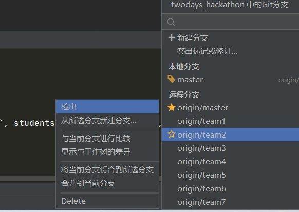

# git快速入门与框架代码获取

首先，你需要[安装 git](https://git-scm.com/downloads)，具体方式可参照[该页面](https://zhuanlan.zhihu.com/p/242540359)

当然你也可以直接安装[Github Desktop](https://desktop.github.com)，该安装程序包含图形化和命令行版本的 Git。 它也能支持 Powershell，提供了稳定的凭证缓存和健全的换行设置。

安装好之后, 你需要进入先进行一些配置工作. 在终端(Windows里为git bash)里输入以下命令

```
git config --global user.name "Zhang San"        # your name
git config --global user.email "zhangsan@foo.com"    # your email
```

经过这些配置, 你就可以开始使用 `git` 了.

## 可视化版本管理(建议)

你可以使用Github Desktop或直接在PyCharm使用git，这里介绍使用pycharm

### 获取框架代码

首先，获取框架代码(git clone)，其中url为

[https://git.nju.edu.cn/SonicLiam/twodays\_hackathon.git](https://git.nju.edu.cn/SonicLiam/twodays\_hackathon.git)

这里需要输入gitlab用户名密码

(以下窗口是pycharm新建项目的窗口，你可以通过 文件>>关闭项目 来打开该窗口)

.png>)

点击运行按钮，测试环境是否配置成功

.png>)

若下方终端无报错

.png>)

且点击该链接出现以下欢迎网页

.png>)

则框架代码获取成功

### 配置flask服务器 <a href="#config_flask_server" id="config_flask_server"></a>

之后，我们还需要手动配置flask服务器。

点击右上角编辑配置

.png>)

新建一个flask服务器配置

.png>)

**勾选FLASK\_DEBUG，进入DEBUG模式，这样，每次修改任意代码都无需重新运行项目，直接刷新页面或重新发送GET/POST请求即可**

Python解释器这里选择全局解释器与虚拟环境解释器均可

.png>)

若遇到相关包缺失，可使用pip安装或直接在pycharm设置中安装

.png>)


### 切换分支(git checkout)

点击右下方git符号，切换到本组对应分支

.png>)



### 进行git管理

pycharm右上角有三个按钮.png>)，我们需要遇到前三个pull, commit, push。分别代表[拉取远程代码](git-kuai-su-ru-men-yu-kuang-jia-dai-ma-huo-qu.md#geng-xin-ben-di-dai-ma)，[暂存本地代码](git-kuai-su-ru-men-yu-kuang-jia-dai-ma-huo-qu.md#cun-dang)，[推送本地代码到远程平台](git-kuai-su-ru-men-yu-kuang-jia-dai-ma-huo-qu.md#ti-jiao-ben-di-dai-ma-dao-yuan-cheng)。具体含义可点击见下文介绍。

其中commit需要手动添加需要暂存的文件，并添加该次commit的说明文字，只有即可将代码变更暂存到本地。

.png>)

push会将最近一次commit推送到服务器上，也就是说push之前一定要commit。

## 通过Git Bash使用git，快速入门git


该部分内容无需实践，只作入门git学习使用


### 光玉 <a href="#guang-yu" id="guang-yu"></a>

想象一下你正在玩Flappy Bird, 你今晚的目标是拿到100分, 不然就不睡觉. 经过千辛万苦, 你拿到了99分, 就要看到成功的曙光的时候, 你竟然失手了! 你悲痛欲绝, 滴血的心在呼喊着, "为什么上天要这样折磨我? 为什么不让我存档?"

想象一下你正在写代码, 你今晚的目标是实现某一个新功能, 不然就不睡觉. 经过千辛万苦, 你终于把代码写好了, 保存并编译运行, 你看到调试信息一行一行地在终端上输出. 就要看到成功的曙光的时候, 竟然发生了段错误! 你仔细思考, 发现你之前的构思有着致命的错误, 但之前正确运行的代码已经永远离你而去了. 你悲痛欲绝, 滴血的心在呼喊着, "为什么上天要这样折磨我?" 你绝望地倒在屏幕前... 这时, 你发现身边渐渐出现无数的光玉, 把你包围起来, 耀眼的光芒令你无法睁开眼睛... 等到你回过神来, 你发现屏幕上正是那份之前正确运行的代码! 但在你的记忆中, 你确实经历过那悲痛欲绝的时刻... 这一切真是不可思议啊...

### 人生如戏, 戏如人生

人生就像不能重玩的Flappy Bird, 但软件工程领域却并非如此, 而那不可思议的光玉就是"版本控制系统". 版本控制系统给你的开发流程提供了比朋也收集的更强大的光玉, 能够让你在过去和未来中随意穿梭, 避免上文中的悲剧降临你的身上.

没听说过版本控制系统就完成实验, 艰辛地排除万难, 就像游戏通关之后才知道原来游戏可以存档一样, 其实玩游戏的时候进行存档并不是什么丢人的事情.

#### 游戏设置 <a href="#you-xi-she-zhi" id="you-xi-she-zhi"></a>

在实验中, 我们使用 `git` 进行版本控制. 下面简单介绍如何使用 `git` .

你可以进入你自己选定的放置项目的文件夹，右键打开git bash，输入如下命令。

在project中, 你会通过 `git clone` 命令下载我们提供的框架代码.


注意，这里需要手动添加ssh-key，具体请STFW


```bash
git clone git@git.nju.edu.cn:SonicLiam/twodays_hackathon.git
```

里面已经包含一些 `git` 记录, 因此不需要额外进行初始化.&#x20;

之后，你可以直接用pycharm打开该项目目录


如果你想在别的实验/项目中使用 `git` , 你首先需要切换到实验/项目的目录中, 然后输入


```
git init
```

进行初始化.


#### 切换分支

你需要使用git checkout命令将你本地仓库切换到你所在小组的分支

```bash
git checkout ...(your branch name)
```

#### 存档

你可以像以前一样编写代码. 等到你的开发取得了一些阶段性成果, 你应该马上进行"存档".

首先你需要使用 `git status` 查看是否有新的文件或已修改的文件未被跟踪, 若有, 则使用 `git add` 将文件加入跟踪列表, 例如

```
git add file.c
```

会将 `file.c` 加入跟踪列表. 如果需要一次添加所有未被跟踪的文件, 你可以使用

```
git add -A
```

但这样可能会跟踪了一些不必要的文件, 例如编译产生的 `.o` 文件, 和最后产生的可执行文件. 事实上, 我们只需要跟踪代码源文件即可. 为了让 `git` 在添加跟踪文件之前作筛选, 你可以编辑 `.gitignore` 文件(你可以使用 `ls -a` 命令看到它), 在里面给出需要被 `git` 忽略的文件和文件类型.

把新文件加入跟踪列表后, 使用 `git status` 再次确认. 确认无误后就可以存档了, 使用

```
git commit
```

提交工程当前的状态. 执行这条命令后, 将会弹出文本编辑器, 你需要在第一行中添加本次存档的注释, 例如"fix bug for xxx". 你应该尽可能添加详细的注释, 将来你需要根据这些注释来区别不同的存档. 编写好注释之后, 保存并退出文本编辑器, 存档成功. 你可以使用 `git log` 查看存档记录, 你应该能看到刚才编辑的注释.

若注释只有一行，例如`Finish stage 0.` ，可直接使用`-m`选项

```bash
git commit -m "Finish stage 0."
```

#### 更新本地代码

当git服务器（如github/gitlab等代码托管平台）的远程代码有更新时，我们需要将远程代码拉取并合并到本地

```bash
git pull
```

其他选项请STFW / RTFM

#### 提交本地代码到远程

当你完成了本项目，需要提交代码，或需要备份本地代码时，需要将本地代码仓库推送到远程

```bash
git push
```

其他选项请STFW / RTFM

#### 更多功能

其它功能的使用请参考 `git help` , `man git` , 或STFW.

若想了解更多关于git的知识，可点击如下链接




STAGE 0 已结束，请尽快点击开始链接，不然你们会后悔的（

